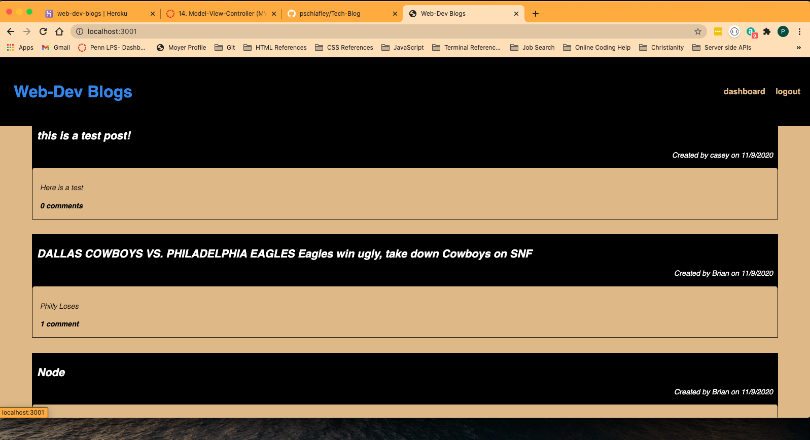
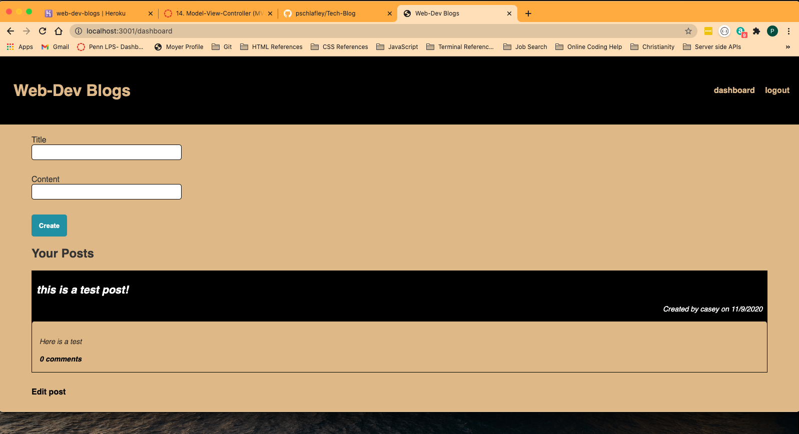

  # Tech-Blog

  
  
  ## Description
  This is a blog application for web developers! Users can create an account, login and then start posting blogs to the site. When logged in you will be able to edit, and delete posts, as well as comment on posts!

  ## Table of Contents

  * [Installation](#installation)
  * [Usage](#usage)
  * [Credits](#credits)
  * [License](#license)
  * [Questions](#questions)

  ## Installation
  npm i
  
  
  ## Usage
  All you need to do is go to https://web-dev-blogs.herokuapp.com/ and you will be able to log in and start using that app
  
  >  
  >  
  
  ## License
  This app is licensed under:
  MIT  

  ## Questions
  If you have any questions you can visit my github profile at <https://github.com/pschlafley/Tech-Blog>
  or you can email me at <pschlafely0@gmail.com>